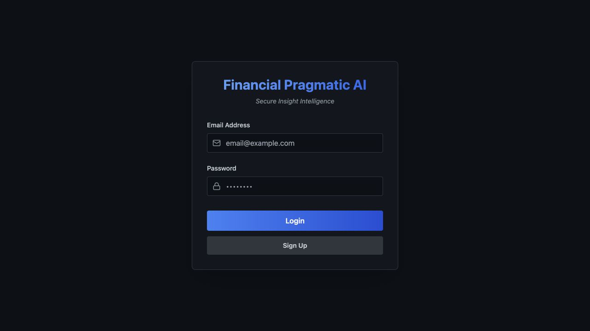
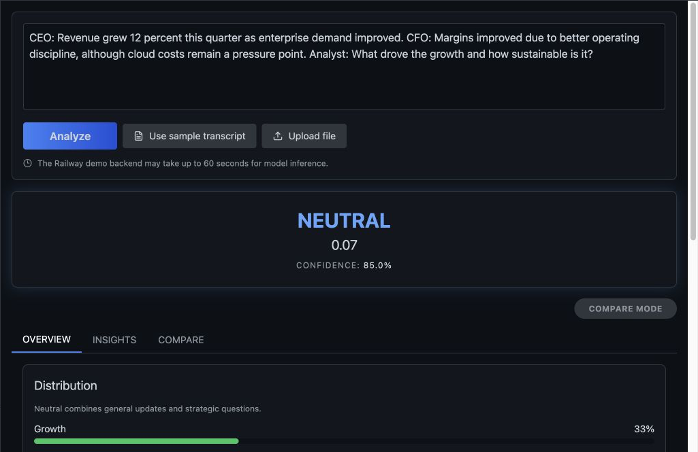
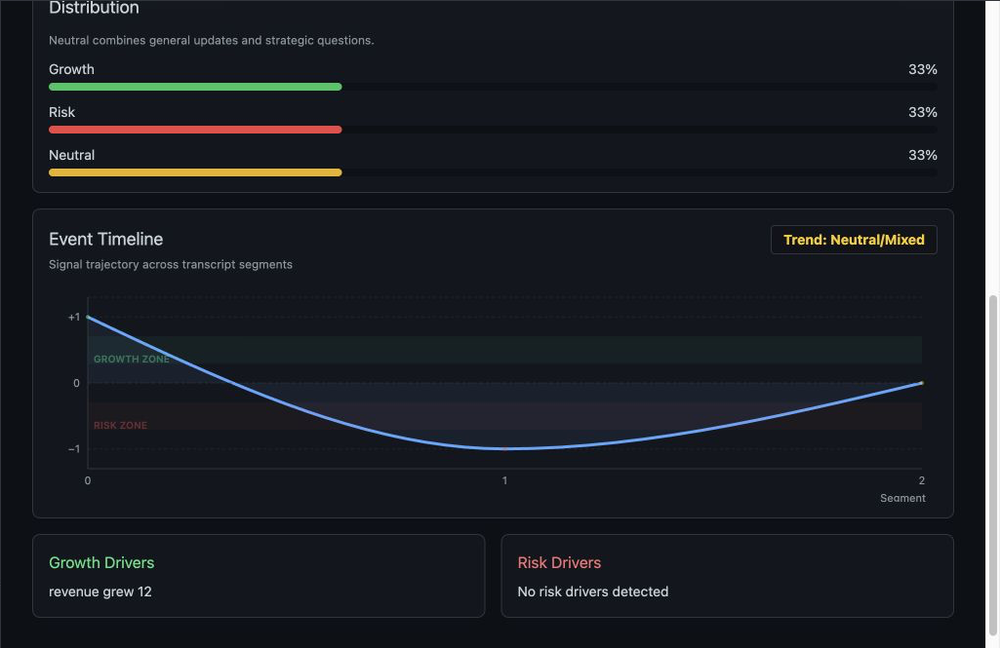
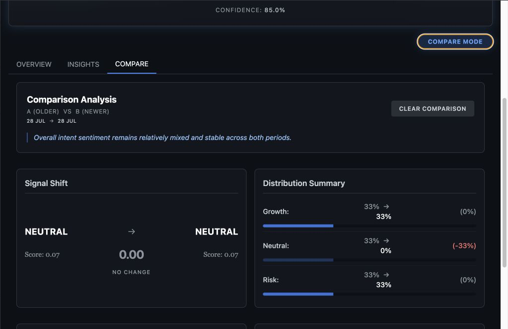
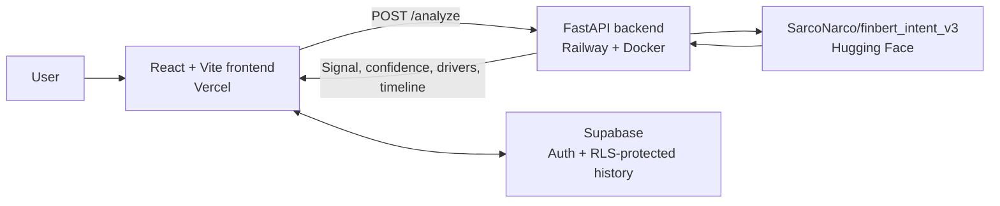
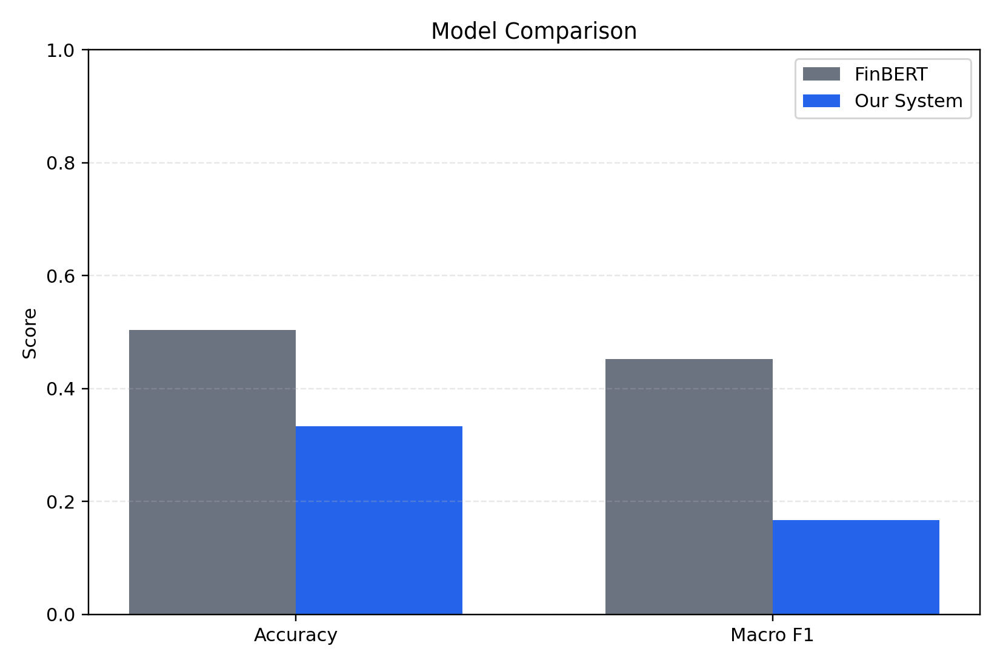

# Financial Pragmatic AI

AI-powered earnings call analysis platform that extracts pragmatic intent, market signal, confidence, volatility, drivers, and timeline from transcript text.

Financial Pragmatic AI is an end-to-end applied NLP portfolio product. It turns earnings-call language into a structured growth, risk, or neutral view and presents the result through a deployed dashboard with authentication, saved history, and side-by-side comparison.

> This project is for research, education, and demonstration purposes. It is not financial advice.

## Live Demo

| Service | Link |
| --- | --- |
| Frontend application | [financial-pragmatic-ai.vercel.app](https://financial-pragmatic-ai.vercel.app/) |
| Backend health | [Railway `/health`](https://financial-pragmatic-ai-production.up.railway.app/health) |
| Backend version | [Railway `/version`](https://financial-pragmatic-ai-production.up.railway.app/version) |

The hosted backend runs CPU inference and may need to download model artifacts after a cold start. The first analysis can therefore take up to about 60 seconds. Long earnings-call transcripts use representative segment sampling for the hosted demo; this is clearly reported and is not exhaustive full-document analysis.

## Screenshots

The following captures use demo data and exclude account identity. The [live demo](https://financial-pragmatic-ai.vercel.app/) remains the interactive reference.

### Authentication



### Analysis Dashboard



### Timeline And Drivers



### Compare Mode



## What It Does

1. Paste an earnings-call transcript or upload a TXT, PDF, or DOCX file.
2. Segment the conversation and classify pragmatic intents such as expansion, cost pressure, general updates, and strategic probing.
3. Aggregate the transcript into a growth, risk, or neutral market signal.
4. Present a score, confidence, intent distribution, and timeline-derived trend or volatility view.
5. Extract the language driving growth and risk interpretations.
6. Save analyses to a private, per-user Supabase history.
7. Compare two saved analyses to inspect changes in signals, distributions, and drivers.

## Architecture



- `frontend_v2/` is the canonical React application deployed on Vercel.
- `backend/api/server.py` is the canonical FastAPI entrypoint deployed as a Docker image on Railway.
- `SarcoNarco/finbert_intent_v3` is loaded from Hugging Face at runtime.
- Supabase provides authentication and the per-user `analyses` history table with Row Level Security.
- The backend is stateless; Railway does not store users or analysis history.

## Official Evaluation

The published project evaluation compares the custom pragmatic-intent system with a FinBERT baseline on a balanced 240-sample benchmark: 80 growth, 80 neutral, and 80 risk examples.

| System | Accuracy | Macro-F1 |
| --- | ---: | ---: |
| Financial Pragmatic AI | **82.92%** | **0.830** |
| FinBERT baseline | 50.42% | 0.452 |
| Improvement | **+32.50 percentage points** | **+0.378** |

The versioned source values are available in [metrics_summary.json](backend/financial_pragmatic_ai/evaluation/better_than_fin/results/metrics_summary.json). Evaluation outputs also include normalized confusion matrices, per-class F1, agreement analysis, and baseline comparison plots.



## Key Features

- Secure email/password authentication and per-user history through Supabase.
- RLS-protected history schema with reproducible setup SQL.
- Transcript paste, TXT/PDF/DOCX upload, and recruiter-friendly sample input.
- Smart hosted-demo handling for long transcripts through representative segment sampling with explicit metadata.
- Growth, risk, and neutral distributions with score and confidence reporting.
- Growth/risk driver extraction and transcript-level event timeline.
- Side-by-side comparison of saved analyses.
- Lightweight `/health` and `/version` deployment endpoints that do not load the model.
- Batched intent inference and production timing logs for the expensive analysis path.
- Configurable transcript-length guardrail before model initialization.
- A 90-second frontend timeout, elapsed-time feedback, and clear save/deployment warnings.
- Dockerized backend plus focused Railway, Vercel, and Supabase deployment guides.

## Tech Stack

| Layer | Technologies |
| --- | --- |
| Frontend | React, Vite, Tailwind CSS, Recharts, Supabase JS |
| Backend | FastAPI, Pydantic, Python, pdfplumber |
| NLP/ML | PyTorch, Transformers, Hugging Face |
| Data and auth | PostgreSQL, Supabase Auth, Row Level Security |
| Deployment | Docker, Railway, Vercel |

## Local Development

### Backend

Python 3.11 is recommended.

```bash
cd backend
python -m venv .venv
source .venv/bin/activate
pip install -r requirements.txt
uvicorn api.server:app --reload --host 0.0.0.0 --port 8000
```

Validate the lightweight endpoints:

```bash
curl http://localhost:8000/health
curl http://localhost:8000/version
```

The first `/analyze` request may download model files from Hugging Face. No backend secret is required for the current public model configuration.

### Frontend

```bash
cd frontend_v2
cp .env.example .env.local
npm install
npm run dev
```

Required frontend variables:

```text
VITE_SUPABASE_URL=YOUR_SUPABASE_PROJECT_URL
VITE_SUPABASE_ANON_KEY=YOUR_SUPABASE_PUBLISHABLE_OR_ANON_KEY
VITE_API_BASE_URL=http://localhost:8000
```

Create the history table and per-user RLS policies by running [supabase/schema.sql](supabase/schema.sql) in the Supabase SQL Editor. Full auth and redirect instructions are in [Supabase Setup](docs/SUPABASE_SETUP.md). Never expose a Supabase service-role key in a `VITE_*` variable.

## Deployment

The live deployment uses four focused services:

- Vercel builds and serves `frontend_v2/`.
- Railway builds `backend/Dockerfile` and runs `api.server:app`.
- Hugging Face hosts the versioned model artifacts.
- Supabase stores authentication and RLS-protected analysis history.

Deployment guides:

- [Railway Backend Deployment](docs/RAILWAY_BACKEND_DEPLOYMENT.md)
- [Frontend Vercel Deployment](docs/FRONTEND_VERCEL_DEPLOYMENT.md)
- [Supabase Setup](docs/SUPABASE_SETUP.md)
- [Deployment Audit](docs/DEPLOYMENT_AUDIT.md)
- [Full-Transcript Strategy](docs/FULL_TRANSCRIPT_STRATEGY.md)
- [Documentation Index](docs/README.md)

Hugging Face Spaces packaging remains documented as an optional fallback; Railway is the active backend target.

## Repository Structure

```text
NLP_Proj/
├── backend/
│   ├── api/                         # Canonical FastAPI API
│   ├── financial_pragmatic_ai/      # NLP, inference, evaluation, and model code
│   ├── scripts/                     # Smoke test and benchmark helpers
│   ├── Dockerfile
│   └── railway.json
├── frontend_v2/                     # Canonical Vite/React frontend
├── frontend/                        # Legacy CRA frontend kept for reference
├── supabase/schema.sql              # Analyses table, index, grants, and RLS policies
├── docs/                            # Setup, deployment, and portfolio documentation
├── scripts/                         # Deployment packaging helpers
└── AGENT_HANDOFF.md                 # Current engineering decisions and context
```

## Known Limitations

- A cold backend can be slow because model artifacts download at runtime and inference runs on CPU.
- Long transcript results may represent a sampled segment budget rather than every source segment; see [Full-Transcript Strategy](docs/FULL_TRANSCRIPT_STRATEGY.md).
- The hosted demo samples inputs above 20,000 characters and rejects only requests above its configurable 250,000-character absolute safety cap by default.
- Uploads support TXT, PDF, and DOCX text extraction only. Legacy `.doc` files are intentionally unsupported because their conversion needs platform-specific tools unsuitable for Railway.
- Runtime inference depends on outbound access to Hugging Face model artifacts.
- The app provides analytical signals for research and demonstration, not investment recommendations.
- `frontend_v2/` is canonical; the older `frontend/` remains only for legacy/reference purposes.

## Roadmap

- Add a RAG layer for contextual investor insights.
- Cite supporting evidence from filings, news, and prior earnings calls.
- Improve saved-analysis titles and history management.
- Optimize model startup, inference latency, and frontend bundle size.
- Add an optional short demo video or GIF.
- For exhaustive long-document workflows, add asynchronous batch processing with persisted progress and results.

## Project Context

This repository packages the full lifecycle of an applied AI product: pragmatic-intent modeling, baseline evaluation, API design, authenticated frontend workflows, containerization, cloud deployment, and reproducible operational documentation.

For a release-readiness pass, see the [Portfolio Checklist](docs/PORTFOLIO_CHECKLIST.md).
